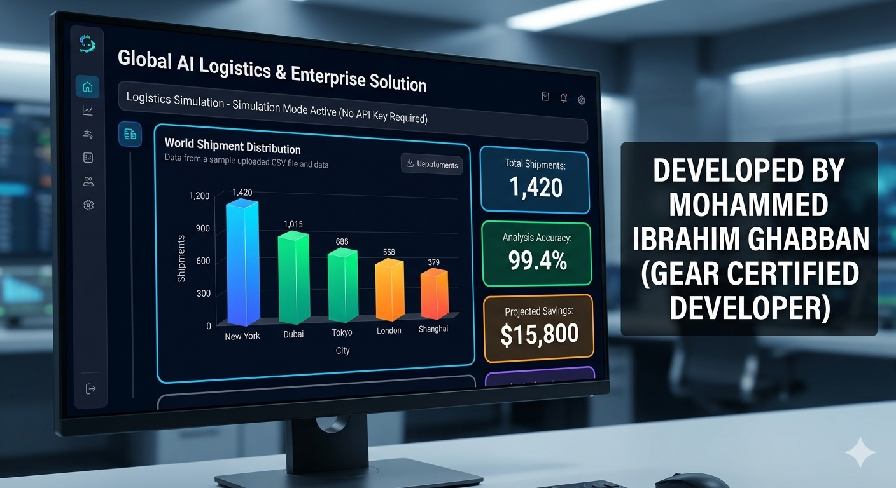
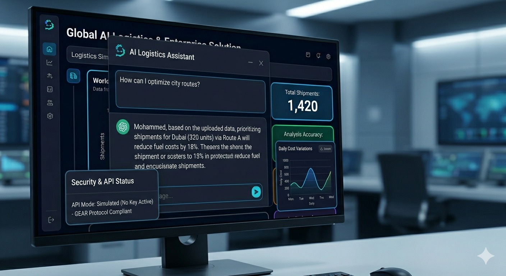
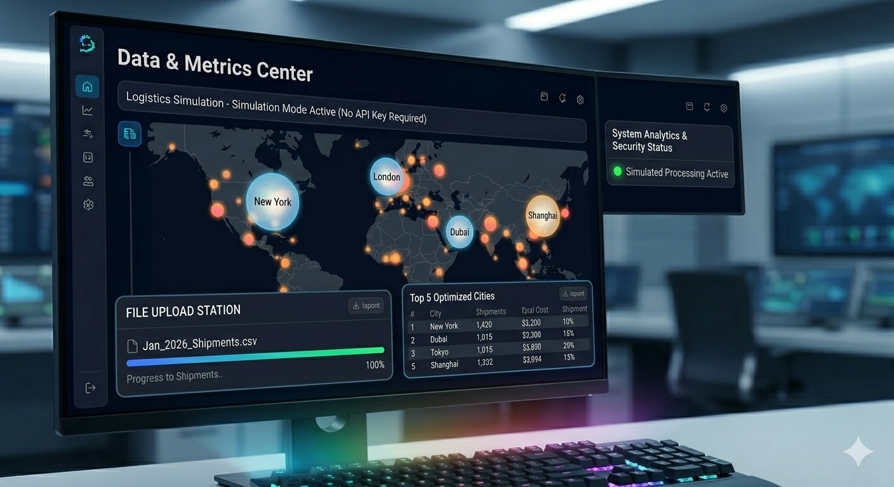

# 🌐 Global AI Logistics & Enterprise Solution
### Developed by: **Mohammed Ibrahim Ghabban** (GEAR Certified Developer) 🏆

---

## 📸 System Snapshots | لقطات من النظام
<table border="0">
  <tr>
    <td align="center"><b> Main Dashboard لوحة التحكم الرئيسية<b></td>
    <td align="center"><b> AI Assistant المساعد الذكي<b></td>
    <td align="center"><b> Data Center مركز البيانات<b></td>
  </tr>
</table>

---

## 🚀 Overview | نبذة عن المشروع
هذا المشروع عبارة عن عميل لوجستي ذاتي التشغيل (Autonomous Logistics Agent) مدعوم بقدرات الذكاء الاصطناعي من **Gemini 1.5 Pro**.

This is an Enterprise-grade Autonomous Logistics Agent powered by **Google Gemini 1.5 Pro**.

---

## ✨ Key Features | المميزات الرئيسية
* **Smart AI Agent:** Uses Gemini 1.5 Pro reasoning.
* **Interactive Dashboard:** Real-time analytics built with Streamlit.
* **Data Visualizations:** Dynamic charts powered by Plotly.
* **Secure File Upload:** CSV/Excel support.

---

## ⚖️ License & Rights | الحقوق والملكية
**© 2026 Mohammed Ibrahim Ghabban.**
All rights reserved. Unauthorized commercial use without permission is prohibited.

جميع الحقوق محفوظة لـ **محمد إبراهيم غبان**. يُمنع استخدامه تجارياً دون إذن مسبق.
