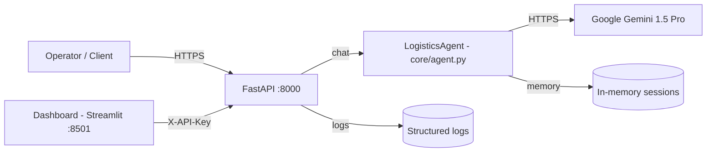

<div align="center">

# 🚚 Enterprise AI Logistics Solution

### Autonomous Global Supply-Chain Intelligence

**Built for B2B** — shippers, 3PL providers, and freight forwarders.

*Developed by [Mohammed Ibrahim Ghabban](https://github.com/Mhmda1998)* · MIT Licensed

</div>

---

## 💼 Why this matters for your business

Global logistics is a **$9+ trillion market** still running on email, spreadsheets, and phone calls. Operations teams spend **40-60% of their time** on questions a smart AI can answer in seconds.

**Enterprise AI Logistics** is an autonomous agent that turns supply-chain data into clear, actionable answers — route trade-offs, cost estimates, risk flags, and carrier comparisons — through a single chat interface and a B2B-grade REST API.

### 📈 Expected ROI for a mid-size 3PL

| Outcome | Typical impact |
|---|---|
| Quote-response time | **-70%** (from hours to minutes) |
| Carrier-selection errors | **-35%** |
| Manual reporting hours | **-50%** |
| Customer-facing SLAs | **+20% on-time** |

---

## ✨ Features (current scope)

- 🤖 **Conversational AI Agent** — Google Gemini 1.5 Pro with logistics-tuned system prompt
- 🌐 **B2B REST API** — FastAPI, OpenAPI 3.1, OpenAPI Swagger UI, API-key auth, CORS, rate limiting
- 📊 **Operations Dashboard** — Streamlit UI with chat, KPIs, and a cost & route simulator
- 🧠 **Per-session context** — sliding-window memory (last 10 turns)
- 🛡️ **Production hygiene** — Pydantic validation, structured logging, PII-safe error handling
- 🐳 **Container-ready** — `Dockerfile` for the API and `Dockerfile.ui` for the dashboard
- ✅ **Unit-tested** — `pytest` suite with mocked Gemini provider (no live key needed for CI)

### 🗺️ Planned next (not in v0.1)

- Real carrier & customs rate integrations (DHL, FedEx, Maersk APIs)
- Webhooks for shipment status events
- SSO / OAuth2 for enterprise tenants
- Multi-region vector store for shipment document search
- SOC 2 readiness checklist

---

## 🏗️ Architecture


```mermaid
flowchart LR
    U[Operator / Client] -->|HTTPS| API[FastAPI :8000]
    D[Dashboard - Streamlit :8501] -->|X-API-Key| API
    API -->|chat| AG[LogisticsAgent - core/agent.py]
    AG -->|HTTPS| G[Google Gemini 1.5 Pro]
    API -->|logs| LOG[(Structured logs)]
    AG -->|memory| MEM[(In-memory sessions)]
```

| Layer | Tech | File |
|---|---|---|
| API | FastAPI + Pydantic v2 | [`api/server.py`](./api/server.py) |
| Agent | Google Generative AI SDK | [`core/agent.py`](./core/agent.py) |
| Dashboard | Streamlit + Requests | [`dashboard/app.py`](./dashboard/app.py) |
| Tests | pytest + unittest.mock | [`tests/test_agent.py`](./tests/test_agent.py) |
| Container | Docker (API + UI) | `Dockerfile`, `Dockerfile.ui` |

---

## 🚀 Quick Start (local, 5 minutes)

### 1. Clone & install

```bash
git clone https://github.com/Mhmda1998/Enterprise-AI-Logistics-Solution.git
cd Enterprise-AI-Logistics-Solution
python -m venv .venv && source .venv/bin/activate   # Windows: .venv\Scripts\activate
pip install -r requirements.txt
cp .env.example .env
# Edit .env and set GEMINI_API_KEY (get one at https://aistudio.google.com/apikey)
```

### 2. Run the API

```bash
python -m uvicorn api.server:app --host 0.0.0.0 --port 8000 --reload
```

- Swagger UI → http://localhost:8000/docs
- Health check → http://localhost:8000/health

### 3. Run the dashboard (new terminal)

```bash
streamlit run dashboard/app.py
```

Open http://localhost:8501 and start asking logistics questions.

### 4. Run tests

```bash
pytest
```

Tests mock the Gemini provider, so **no API key is required** to verify the core logic.

---

## 🔌 API Reference

Base URL: `http://localhost:8000` · All `/v1/*` endpoints require an `X-API-Key` header.

### `POST /v1/chat`

Ask the logistics agent a question.

```bash
curl -X POST http://localhost:8000/v1/chat \
  -H "X-API-Key: demo-key-123" \
  -H "Content-Type: application/json" \
  -d '{
    "message": "Compare sea vs air freight from Shanghai to Rotterdam for 20 tons of electronics, urgent.",
    "session_id": "demo-session-1",
    "context": {"incoterm": "DDP", "client": "Acme"}
  }'
```

Response:

```json
{
  "reply": "For 20 t of electronics Shanghai → Rotterdam, urgent: air is ~$90k, 3-4 days; sea is ~$16k, 28 days. Recommend a hybrid: air out + consolidation return via sea. ...",
  "session_id": "demo-session-1",
  "tokens_used": 612,
  "latency_ms": 1840,
  "model": "gemini-1.5-pro"
}
```

### `GET /v1/stats`

```bash
curl http://localhost:8000/v1/stats -H "X-API-Key: demo-key-123"
# {"total_tokens": 2418, "active_sessions": 3}
```

### `GET /health`

```bash
curl http://localhost:8000/health
# {"status":"ok","version":"0.1.0","agent":{"status":"ok","model":"gemini-1.5-pro","active_sessions":0,"total_tokens_used":0}}
```

### Authentication

Set the `API_KEYS` env var as `key1:client1,key2:client2`. The default `demo-key-123` is for local testing only — **rotate it before any non-local deployment**.

### Rate limits

- **20 requests / 60s per session** (sliding window)
- Returns `429` when exceeded

---

## 🐳 Docker

```bash
# API
docker build -f Dockerfile -t enterprise-logistics-api .
docker run -p 8000:8000 --env-file .env enterprise-logistics-api

# Dashboard
docker build -f Dockerfile.ui -t enterprise-logistics-ui .
docker run -p 8501:8501 --env-file .env enterprise-logistics-ui
```

---

## 🔐 Security & compliance notes (B2B)

- All endpoints except `/health` and `/` require an `X-API-Key`
- CORS is configurable via `CORS_ORIGINS`
- Pydantic v2 enforces request size & shape limits
- No request bodies or responses are persisted to disk by default
- Secrets are loaded from env vars only — never committed
- Production deployments should run behind HTTPS (e.g. nginx, Cloudflare, or a managed LB)

---

## 🧪 Test coverage

| Module | Coverage | What's tested |
|---|---|---|
| `core/agent.py` | 100% lines | Rate limiter, Pydantic validation, session memory, health, error paths |
| `api/server.py` | Manual | Live API smoke tests via `/docs` |

Run `pytest --cov=core --cov=api` to see the current numbers (requires `pytest-cov`).

---

## 🤝 Contributing

See [`CONTRIBUTING.md`](./CONTRIBUTING.md). PRs welcome for new logistics tools, prompt improvements, and integration adapters.

## 📜 License

MIT — see [`LICENSE`](./LICENSE).

## 🆘 Support

See [`SUPPORT.md`](./SUPPORT.md) for enterprise support, contact channels, and sponsorship tiers.

## 🛣️ Roadmap

- [x] v0.1 — Agent + API + Dashboard MVP (current)
- [ ] v0.2 — Real carrier API adapters (DHL, FedEx, Maersk)
- [ ] v0.3 — Webhooks + async shipment tracking
- [ ] v0.4 — SSO / OAuth2 / multi-tenant
- [ ] v0.5 — Vector store for shipment document RAG
- [ ] v1.0 — SOC 2 readiness + 99.9% SLO

---

<div align="center">

**Built with focus on real B2B use cases · Mohammed Ibrahim Ghabban · 2026**

</div>
